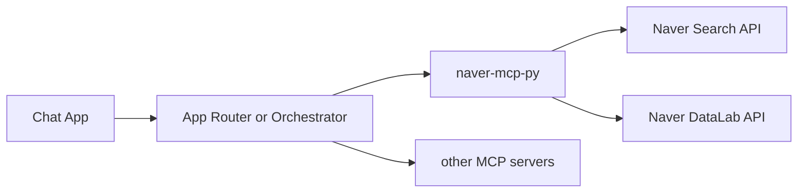

# Architecture

## Overview

`naver-mcp-py` is a dedicated Python repository that exposes Naver Search API and DataLab as MCP tools.

The repository supports two modes:

- library mode: imported directly by another Python app
- server mode: exposed as a FastMCP server over `streamable-http`

## Why This Repository Exists

The main chat application should not own:

- Naver API authentication
- source-specific normalization
- search-specific caching and retries
- DataLab request shaping

By isolating those concerns here, chat applications can focus on routing and reply rendering.

## System Context

Typical deployment:



## Repository Responsibilities

- authenticate against Naver APIs
- expose stable MCP tool surfaces
- normalize heterogeneous API responses into shared shapes
- handle timeout, retry, and cache policies
- provide a reusable server entry point for MCP deployment

## Non-Goals

- final end-user message phrasing
- persona or prompt logic
- room or channel policy
- multi-step planning across different domains

## Internal Layers

```text
server.py
  -> tools_search.py / tools_datalab.py
    -> client.py
    -> normalize.py
    -> models.py
    -> cache.py
```

### `config.py`

Holds environment parsing and defaults:

- API credentials
- host and port
- MCP transport configuration
- timeout and cache settings

### `client.py`

Owns raw HTTP calls to Naver APIs.

Responsibilities:

- build request headers
- send HTTP requests
- handle status codes
- map transport failures into structured exceptions

### `normalize.py`

Transforms raw Naver payloads into a stable contract.

Responsibilities:

- strip HTML tags
- normalize timestamps
- build common item fields
- preserve useful source-specific fields
- de-duplicate combined results for composite tools when needed

### `tools_search.py`

Exposes search-related MCP tools.

Implemented tools:

- `search_local`
- `search_blog`
- `search_web`
- `search_news`
- `search_cafearticle`
- `spell_check`
- `detect_adult_query`
- `search_naver_auto`

### `tools_datalab.py`

Exposes trend-related MCP tools.

Implemented tools:

- `datalab_search_trends`
- `datalab_shopping_category_trends`
- `datalab_shopping_device_trends`

### `server.py`

Defines:

- FastMCP server object
- MCP tool registration
- main process entry point
- a lightweight `healthz()` helper for embedding scenarios

## Design Decisions

### Common Response Contract

Whenever practical, search tools return:

```json
{
  "query": "example query",
  "source": "local",
  "items": [],
  "meta": {
    "total": 0,
    "start": 1,
    "display": 5,
    "cached": false
  }
}
```

This keeps clients simple and makes composite tools easier to build.

### Common Item Contract

All search tools try to emit:

```json
{
  "title": "normalized title",
  "link": "https://...",
  "snippet": "normalized description",
  "source": "local|blog|web|news|cafearticle",
  "published_at": "2026-03-18T12:00:00+09:00",
  "score": 0.0
}
```

Source-specific fields are added without breaking the common shape.

### Composite Tool Policy

`search_naver_auto` is allowed to route across multiple sources, but it must:

- expose the selected intent
- list the sources used
- keep merge rules simple and documented

Composite tools are helpers. Low-level tools remain first-class.

## Reliability Policy

- Search tools should fail fast on timeout.
- Errors should include a stable error code and retryable flag.
- Cache should be conservative and time-bounded.
- Credential errors should surface clearly.

## Cache Guidance

Recommended defaults:

- search: 5 minutes
- spell/adult detection: 30 minutes
- DataLab trends: 30 minutes or longer

## Integration Guidance

Clients should choose one of two patterns:

### Pattern A. Direct deterministic use

Use low-level tools directly when the intent is obvious.

Examples:

- place search
- recipe lookup
- simple news lookup

### Pattern B. Orchestrated use

Let an orchestrator decide when to call this MCP server together with others.

Examples:

- multi-domain assistant responses
- answers requiring internal data plus public search data

This repository should support both patterns cleanly.

